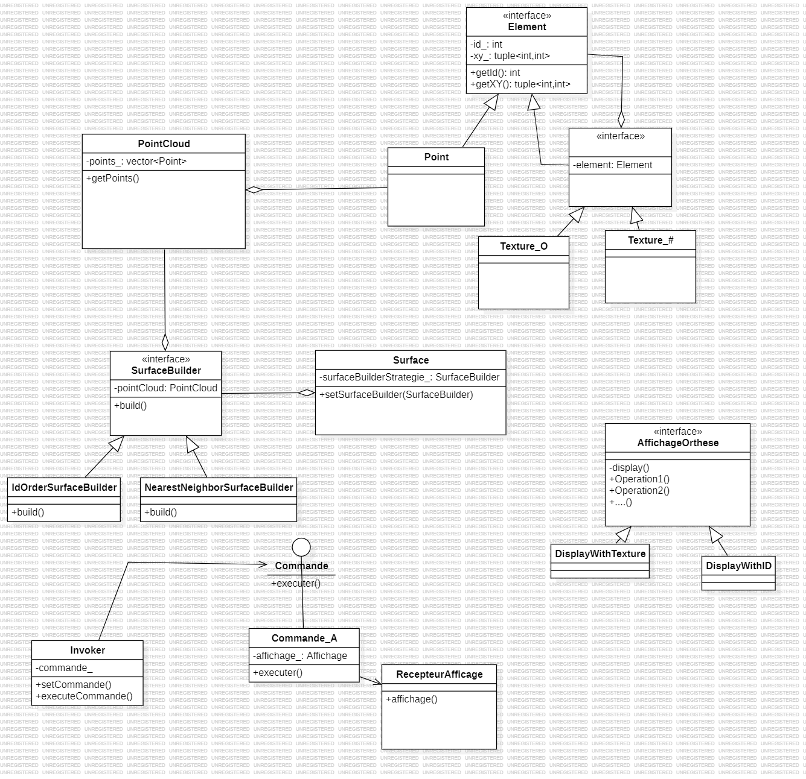

# TP4-LOG2400 — Mini Design

Brief student project for LOG2400: a small C++ application that models points, surfaces and display strategies.

**Project**

- **Language:** C++ (C++11/17 compatible)
- **Files:** contains headers and implementations for points, surfaces, builders, textures and display logic.

**Build (example, using g++)**

Use PowerShell or a terminal with a C++ compiler installed (g++/clang++/MSVC). From the project root run:

```powershell
g++ -std=c++17 *.cpp -o MiniDesign.exe
```

Adjust the command to match your compiler and environment (or open the project in Visual Studio / CLion).

**Run**

```powershell
./MiniDesign.exe
```

**Structure (high level)**

- `Point`, `PointBase`, `PointCloud` — point representations and containers.
- `Surface`, `SurfaceBuilder` and implementations (`NearestNeighborSurfaceBuilder`, `IdOrderSurfaceBuilder`) — surface construction strategies.
- `Affichage*` and `Texture*` files — display and texture handling.
- `Invocateur`, `Commande_*` — command pattern for interactions.

**Class Diagram**

The main class diagram is included in the repository. Preview it here:



**Commit example**

To add and commit this README:

```powershell
git add README.md
git commit -m "docs: add README with class diagram" -m "Add project README and embed UML class diagram (UmlMiniDesign.png)."
```

If you want, I can also create a small `CMakeLists.txt` or adjust build instructions for your preferred toolchain.
